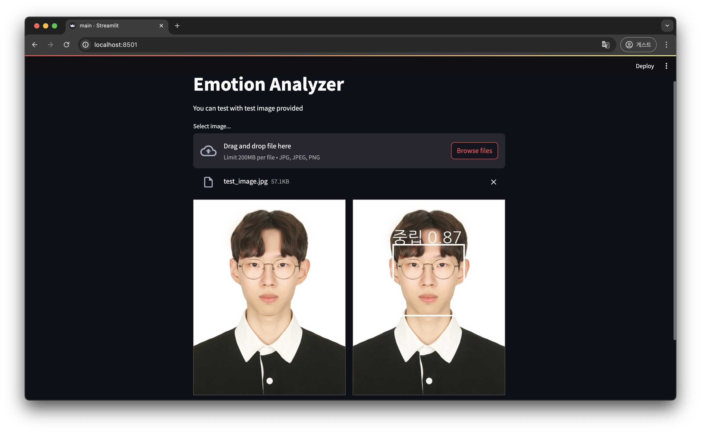
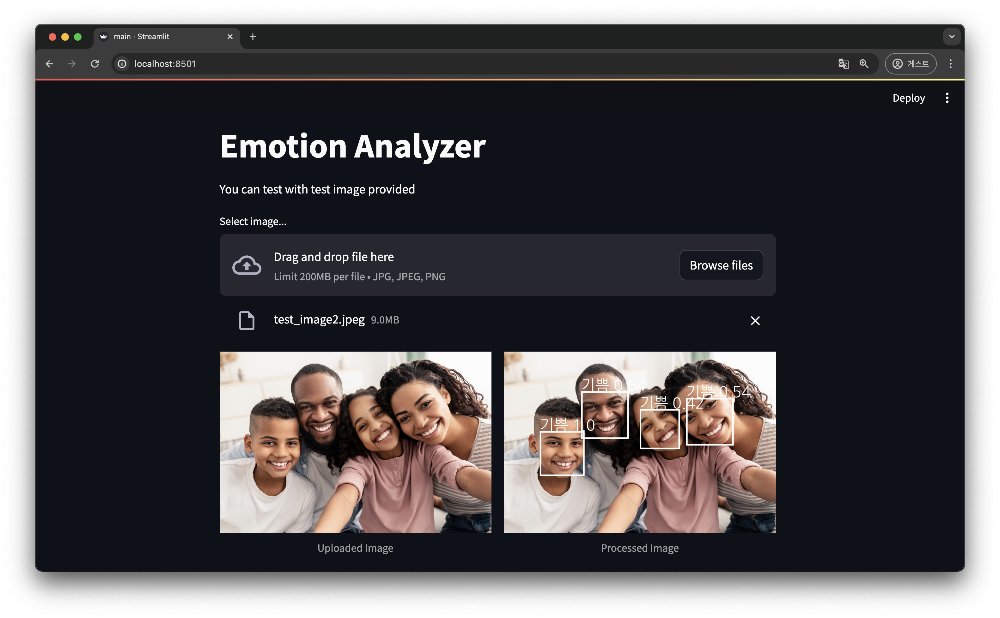
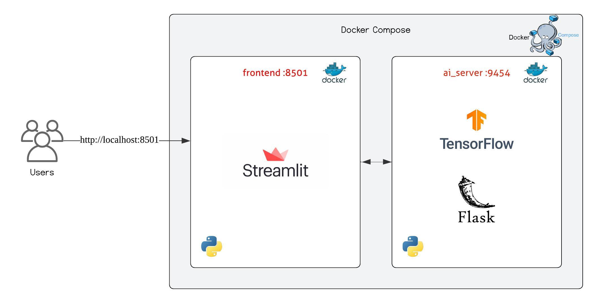

# EmotionAnalyzerWebApp

## Preview





## Getting Started

Follow these steps to run the project locally:

1. **Clone the repository:**

   Open your terminal and run the following command to clone the repository:
   ```Shell
   git clone https://github.com/guhyun9454/EmotionAnalyzerWebApp
   ```

2. **Navigate to the project directory:**

   After cloning, change into the project directory:
   
   ```Shell
   cd [cloned directory]
   ```

3. **Start the application:**

   Run the following command in the terminal to start the application using Docker Compose:

   ***Make sure that you installed and run Docker Desktop or Docker Daemon***
   ```Shell
   docker compose up
   ```

4. **Access the application:**

   Open your web browser and go to "http://localhost:8501" to experience the application.

5. **Explore**
   
   Test with your own images or test image provided.
   
   ***Accuracy may be poor for faces that do not look forward.***

5. **Stop the application**

   To stop and remove all stuffs created by `docker compose up`, run the following command in the terminal:
   ```Shell
   docker compose down  
   ```

## Architecture

